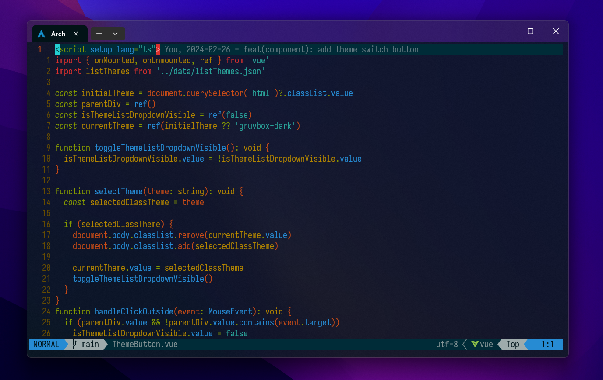
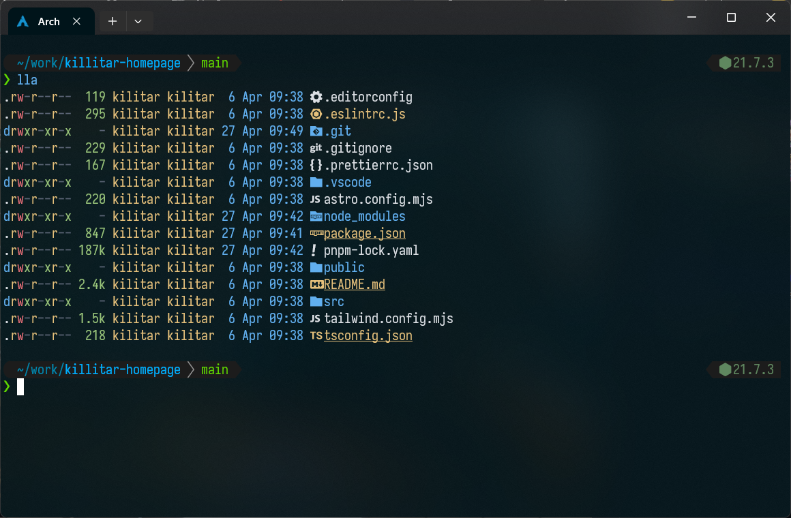

# Miroslav's dotfiles

This is my configs file of neovim and shell, this config is designed primarily for coding. As such, it has a lot of LSP and syntax plugins. I have it configured mainly for web development

## Neovim setup

### Requirements

- Neovim >= **0.9.0**
- Git >= **2.19.0**
- npm
- [Nerd Font](https://www.nerdfonts.com/)(v3.0 or greater) **need to display icons**
- **C** compiler for `nvim-treesitter`.
- for [telescope.nvim](https://github.com/nvim-telescope/telescope.nvim)
  - **live grep**: [ripgrep](https://github.com/BurntSushi/ripgrep)
  - [fzf](https://github.com/PatrickF1/fzf.fish)

## Shell setup (macOS & Linux)

- [Fish shell](https://fishshell.com/)
- [Fisher](https://github.com/jorgebucaran/fisher) - Plugin manager
- [Tide](https://github.com/IlanCosman/tide) - Shell theme
- [Nerd Font](https://www.nerdfonts.com/)(v3.0 or greater) **need to display icons**
- [z](https://github.com/rupa/z) - Directory jumping
- [Eza](https://github.com/eza-community/eza) - `ls` replacement
- [fzf](https://github.com/PatrickF1/fzf.fish) - Interactive filtering

## Tmux setup

- [tmp](https://github.com/tmux-plugins/tpm) - tmux plugin manager
